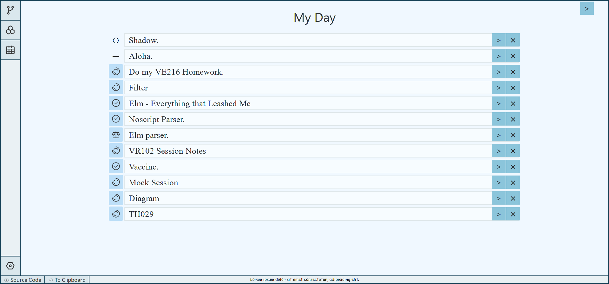
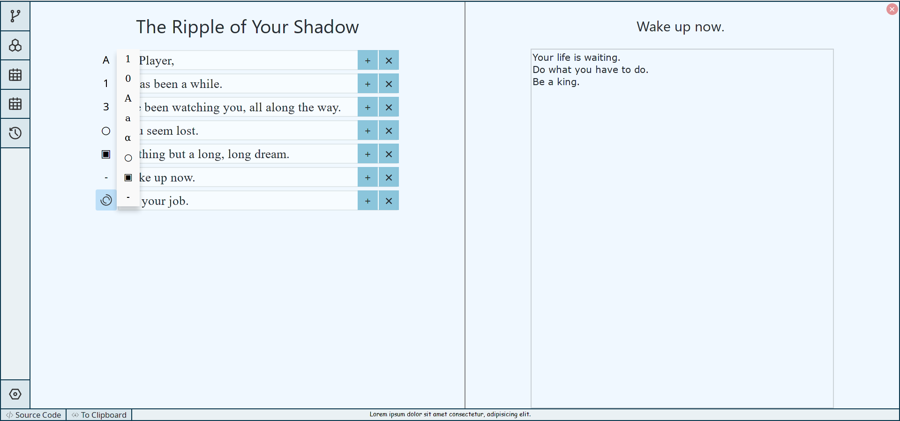

# Flow.er

## After 2 years of silence...

I've grown and learnt a lot from my experience with programming and software development, and most importantly, how to make a notebook app meaningful. The ecosystem has dramtically evolved, and I'm glad to see that. I'm planning to rewrite the project in my free time.

Below is the corpus of what was done 2 years ago, when I was still young.

---

A *notebook* app integrated with *todo-list* utility.

Project *flow.er* is a Rust WASM app running in browser. Taking advantage of Yew and Trunk, it provides good development experience.

***Notice: this repo is under heavy development, and is currently not usable. To see the demo version, you can try `flower-yew-lock` branch, which is the last version of this software and is already usable, and follow the instructions below.***

## Screenshots





## Try It!

### Dev Install

This projects uses `trunk` as a Rust WASM application bundler.

First, install [`rust & cargo`](https://www.rust-lang.org/learn/get-started). Note that `cargo` is auto-installed if you follow the instructions.

Next, install [`trunk`](https://github.com/thedodd/trunk) by the following (or just follow the instructions provided on the link)
```bash
$ cargo install --locked trunk
$ cargo install wasm-bindgen-cli
```

### Dev Serve

After following intructions above, you'll be able to serve the app locally.

First, clone / download this repo: https://github.com/LighghtEeloo/flow.er.git.

Then just switch to `flow.er/flow_vase/flow_yew` folder and run `trunk serve`. This will serve the app on `127.0.0.1:9720`, which can be visited via your preferred browser.

The whole process will be like:
```bash
$ git clone https://github.com/LighghtEeloo/flow.er.git && cd flow.er/flow_vase/flow_yew
$ trunk serve
```
And then visit `127.0.0.1:9720` via your browser.

Maybe you will fail to compile on your first run with some error messages like:
```bash
[INFO]: Checking for the Wasm target...
Error: wasm32-unknown-unknown target not found!
```

Don't panic. Simply add
```bash
rustup target add wasm32-unknown-unknown
```
and everything will be fine.

Feel free to fire an issue if anything troubles you (❁´◡`❁)


## Supported Browsers

Chrome, Firefox and Edge are (roughly) tested and all seem to be working well. 

However, only desktop versions are considered for now.

## Disclaimer

This is a completely personal, non-profit project, mainly aiming at learning rust-lang, yew and the surrounding toolchains. I can try my best, but I won't be responsible for any of your potential data loss. 

For now, this software isn't data-safe. Use at your own risk. This may get better as I develop, and you're welcomed to help improving it.


## Todo
See [todo.md](./todo.md).


## Vision

The final goal of this project is to create a *notebook* and *mind-map* app with is integrated with *todo-list* and *agenda* views. 

It will be supporting patches to incrementally save your previous work, denoted by *time-capsule* function.

## Project Technical Detail

### Library Structure

The * directories are important ones.
```
.
├── flow_arena          * -- an implementation of "flow" data-structure
├── flow_vase           * -- user interface part
│   ├── flow_cli          -- (in progress) a cli flow app
│   ├── flow_ish          -- (not implemented) a responsive terminal flow app
│   ├── flow_iced         -- (deprecated) trying `iced`
│   ├── flow_acc        * -- a `yew` GUI with modern html+scss features
│   └── flow_yew          -- (deprecated) a `yew` GUI attempt
├── flow_vessel         * -- the "flow_core" part, with all the non-UI logic
└── src                   -- (not implemented) the skeleton of this package
```

### Underlying Data Structure: Flow and Entity

"Flow" is the core data-structure implemented and used in this project. It's a superset of the classical "tree". 

---

On hearing mindmaps, the intuitive representation would be "tree", or even better, "graph". However, Rust's strict borrow checker makes it hard and potentially unsafe to implement either of them. Moreover, trees are too powerless while the graphs are too complicated for the mindmap scenario. 

A specific example would be: "I have a tree-like mindmap, good, but what if this node should belong to two parents?"

If you are interested in this problem, please find the details on `Flow` [here](./flow_arena/README.md).

`Flow` is implemented in flow_arena, as `FlowArena`.

---

As for `Entity`, it's the content of every node. Every entity has a (hopefully) unique id, `EntityId`. It can be generated by:
1. The current time combining a u64 random number.
2. Or just from a factory with its incremental counter.

`Entity` features the following functions:
1. face: the name of the entity.
2. bubble: a detailed description / note of the entity.
3. symbol: whether it's...
   1. An ordered / unordered list entry.
   2. A todo-list entry.
   3. Plain.
4. tags: a tag system.
5. time-notes: whether it's agenda-visible, as a duration.

`Entity` is implemented in flow_vessel.

### About Vessel, Glass, and Vase

`Vessel` is everything that needs to be stored. Suppose you close the app and reopen it, the only data left will be the data stored in `Vessel`. Though it has nothing to do with any specific UI, it does it's best to extract the common UI structure and logic, so that the different visits can share the most information. It impls `Serialize` and `Deserialize` and stores by json.

`Glass` handles a shared data structure for all UIs. It is stored within a vessel. It's a map of (`Router`, `Cube`), which should have been a struct fielded by the routers, but the map provides fancy reflect function and ... here we are. `Cube` is an abstract session structure; we'll cover it soon.

`Vase` implements the GUI part. In the yew version, `Vase` impls `yew::Component`. Unfortunately it's currently the only `Component` becuase I still have trouble handle the global data access and update, which are all over my code. In the short future, I'll try the functional approach.


### Cube, CubeViewCore and CubeVM

The `Cube` is a piece of UI session data stored by `Glass`; while `CubeVM` is the runtime UI session data created on-site. Though keeping them identical and updated is hard, it's even trickier how to abstract them to store and show polymorphism.

The data storage of, say, a bunch of differently typed structs which share the same trait, is always a headache. Two different approaches are adopted at the vessel and vase side, separately.

// Todo..

### At Last, About Storage

This project is currently using local storage to save cache, and supports downloading all progress / exporting to clipboard. One can import data back with source code mode. In the future, a local server or a cloud server will be served instead to guarantee data safety.

